# Proxi App - Complete Data Flow Architecture

This diagram shows the complete data flow from Arduino UWB hardware to iOS app, including the MVVM architecture, BLE communication protocol, and UWB ranging implementation.

```mermaid
flowchart TB
    %% Hardware Layer
    subgraph HW ["🔧 Arduino Hardware Layer"]
        ARDUINO["Arduino Nano 33 BLE<br/>with StellaUWB Library"]
        UWB_CHIP["UWB Chip<br/>(Ultra-Wideband Radio)"]
        BLE_CHIP["BLE Chip<br/>(Bluetooth Low Energy)"]
        ANTENNA["UWB Antenna<br/>(Ranging Hardware)"]
        
        ARDUINO --> UWB_CHIP
        ARDUINO --> BLE_CHIP
        UWB_CHIP --> ANTENNA
    end
    
    %% Arduino Firmware Layer
    subgraph FIRMWARE ["⚙️ Arduino Firmware Layer"]
        INIT_FIRMWARE["Device Initialization<br/>• BLE device name: 'Arduino UWB'<br/>• UUID: ABCDEF12-...<br/>• Multi-device support (8 max)"]
        UWB_MANAGER["UWB Session Manager<br/>• StellaUWB library<br/>• Device tracking<br/>• Session management"]
        BLE_ADV["BLE Advertising<br/>• Service UUID: 6E400001-...<br/>• RX/TX Characteristics<br/>• Qorvo service support"]
        MULTI_DEV["Multi-Device Handler<br/>• ConnectedDevice array<br/>• Device ID assignment<br/>• Connection timeout handling"]
        HEARTBEAT["Heartbeat & Keepalive<br/>• 1s heartbeat interval<br/>• Connection monitoring<br/>• Auto-reconnection"]
        
        INIT_FIRMWARE --> UWB_MANAGER
        INIT_FIRMWARE --> BLE_ADV
        BLE_ADV --> MULTI_DEV
        MULTI_DEV --> HEARTBEAT
    end
    
    %% BLE Communication Protocol
    subgraph PROTOCOL ["📡 BLE Communication Protocol"]
        SERVICE_UUID["Transfer Service<br/>UUID: 6E400001-B5A3-F393-E0A9-E50E24DCCA9E"]
        RX_CHAR["RX Characteristic<br/>UUID: 6E400002-... (iOS → Arduino)"]
        TX_CHAR["TX Characteristic<br/>UUID: 6E400003-... (Arduino → iOS)"]
        
        subgraph MSG_TYPES ["Message Types (BLEMessageId)"]
            MSG_INIT["0xA: Initialize UWB"]
            MSG_CONFIG["0xB: Configure & Start"]
            MSG_STOP["0xC: Stop Ranging"]
            MSG_ACCESS_CONFIG["0x1: Accessory Config Data"]
            MSG_UWB_START["0x2: UWB Did Start"]
            MSG_UWB_STOP["0x3: UWB Did Stop"]
        end
        
        SERVICE_UUID --> RX_CHAR
        SERVICE_UUID --> TX_CHAR
        RX_CHAR --> MSG_TYPES
        TX_CHAR --> MSG_TYPES
    end
    
    %% iOS App Architecture - Model Layer
    subgraph MODEL ["📱 iOS Model Layer (Business Logic)"]
        BLE_MANAGER["BLEManager.swift<br/>• ObservableObject<br/>• CBCentralManagerDelegate<br/>• Multi-device support<br/>• Published properties"]
        
        subgraph BLE_PROPS ["BLE Manager Properties"]
            CONNECTED_DEVS["@Published connectedPeripherals<br/>[UUID: CBPeripheral]"]
            DEVICE_DATA["@Published connectedDevicesData<br/>[UUID: DeviceData]"]
            UWB_LOCATION["@Published uwbLocation<br/>UWBLocation struct"]
            DEBUG_LOG["@Published debugLog<br/>[String]"]
            CONNECTION_STATUS["@Published connectionStatus<br/>isConnected, isRanging"]
        end
        
        NI_MANAGER["NISessionManager.swift<br/>• NISessionDelegate<br/>• Multi-session support<br/>• Discovery token management"]
        
        subgraph NI_PROPS ["NI Session Properties"]
            NI_SESSIONS["niSessions: [UUID: NISession]"]
            NI_CONFIGS["configurations: [UUID: NINearbyAccessoryConfiguration]"]
            DISCOVERY_TOKENS["accessoryDiscoveryTokens: [UUID: NIDiscoveryToken]"]
        end
        
        LOCATION_MGR["LocationManager.swift<br/>• CoreLocation integration<br/>• Device heading<br/>• Coordinate system alignment"]
        
        BLE_MANAGER --> BLE_PROPS
        NI_MANAGER --> NI_PROPS
        BLE_MANAGER --> NI_MANAGER
        BLE_MANAGER --> LOCATION_MGR
    end
    
    %% iOS App Architecture - ViewModel Layer
    subgraph VIEWMODEL ["🎯 iOS ViewModel Layer"]
        DEVICE_VM["Device ViewModels<br/>• Device state management<br/>• UI data transformation<br/>• Command handling"]
        UWB_VM["UWB ViewModels<br/>• Location data processing<br/>• Ranging state management<br/>• Direction calculations"]
        CONNECTION_VM["Connection ViewModels<br/>• Scanning state<br/>• Connection management<br/>• Error handling"]
        
        DEVICE_VM --> UWB_VM
        CONNECTION_VM --> DEVICE_VM
    end
    
    %% iOS App Architecture - View Layer
    subgraph VIEW ["👁️ iOS View Layer (SwiftUI)"]
        HOME_VIEW["HomeView.swift<br/>• Main dashboard<br/>• Connection status<br/>• Quick actions"]
        DISCOVER_VIEW["DiscoverView.swift<br/>• Device scanning<br/>• Device list display<br/>• Connection controls"]
        DEVICE_COMPONENTS["Device Components<br/>• DeviceRowView<br/>• QorvoDeviceRowView<br/>• AccessoriesTable"]
        UWB_COMPONENTS["UWB Components<br/>• WorldView<br/>• ArrowView<br/>• Location visualization"]
        
        HOME_VIEW --> DEVICE_COMPONENTS
        DISCOVER_VIEW --> DEVICE_COMPONENTS
        DEVICE_COMPONENTS --> UWB_COMPONENTS
    end
    
    %% Data Flow Connections
    
    %% Hardware to Firmware
    ARDUINO -.->|"Initialize"| INIT_FIRMWARE
    UWB_CHIP -.->|"UWB Data"| UWB_MANAGER
    BLE_CHIP -.->|"BLE Stack"| BLE_ADV
    
    %% Firmware to Protocol
    BLE_ADV -.->|"Advertise Services"| SERVICE_UUID
    MULTI_DEV -.->|"Message Handling"| MSG_TYPES
    HEARTBEAT -.->|"Status Updates"| TX_CHAR
    
    %% Protocol to iOS Model
    RX_CHAR -.->|"Commands"| BLE_MANAGER
    TX_CHAR -.->|"Data & Status"| BLE_MANAGER
    MSG_TYPES -.->|"Protocol Messages"| BLE_PROPS
    
    %% iOS Model to ViewModel
    BLE_PROPS -.->|"Published Changes"| VIEWMODEL
    NI_PROPS -.->|"UWB Data"| UWB_VM
    LOCATION_MGR -.->|"Location Data"| UWB_VM
    
    %% ViewModel to View
    VIEWMODEL -.->|"UI State"| VIEW
    UWB_VM -.->|"Position Data"| UWB_COMPONENTS
    CONNECTION_VM -.->|"Connection State"| DEVICE_COMPONENTS
    
    %% UWB Ranging Flow
    subgraph UWB_FLOW ["🎯 UWB Ranging Data Flow"]
        UWB_INIT["1. UWB Initialization<br/>iOS → Arduino: 0xA"]
        UWB_CONFIG["2. Configuration Exchange<br/>NISession generates token<br/>iOS → Arduino: 0xB + config"]
        UWB_START["3. Ranging Start<br/>Arduino → iOS: 0x2"]
        UWB_RANGING["4. Active Ranging<br/>Continuous distance/direction<br/>updates via NearbyInteraction"]
        UWB_UPDATE["5. UI Updates<br/>Real-time position display<br/>Arrow direction, distance"]
        
        UWB_INIT --> UWB_CONFIG
        UWB_CONFIG --> UWB_START
        UWB_START --> UWB_RANGING
        UWB_RANGING --> UWB_UPDATE
    end
    
    %% Multi-Device Support Flow
    subgraph MULTI_FLOW ["👥 Multi-Device Support Flow"]
        SCAN_START["Device Scanning<br/>BLEManager.startScanning()"]
        DEVICE_DISCOVER["Device Discovery<br/>CBCentralManagerDelegate"]
        MULTI_CONNECT["Multiple Connections<br/>Up to 8 Arduino devices"]
        SESSION_MGMT["Session Management<br/>Individual NISession per device"]
        DATA_MERGE["Data Aggregation<br/>Combined location data"]
        
        SCAN_START --> DEVICE_DISCOVER
        DEVICE_DISCOVER --> MULTI_CONNECT
        MULTI_CONNECT --> SESSION_MGMT
        SESSION_MGMT --> DATA_MERGE
    end
    
    %% Error Handling & Recovery
    subgraph ERROR_FLOW ["⚠️ Error Handling & Recovery"]
        CONNECTION_LOSS["Connection Loss Detection"]
        TIMEOUT_HANDLE["Timeout Handling<br/>10s connection timeout"]
        AUTO_RECONNECT["Auto-Reconnection<br/>BLE advertising restart"]
        SESSION_RECOVERY["Session Recovery<br/>NISession invalidation handling"]
        
        CONNECTION_LOSS --> TIMEOUT_HANDLE
        TIMEOUT_HANDLE --> AUTO_RECONNECT
        AUTO_RECONNECT --> SESSION_RECOVERY
    end
    
    %% Connect flows to main architecture
    BLE_MANAGER -.->|"Initiates"| UWB_FLOW
    BLE_MANAGER -.->|"Manages"| MULTI_FLOW
    BLE_MANAGER -.->|"Handles"| ERROR_FLOW
    
    %% Real-time Update Flow
    UWB_RANGING -.->|"NearbyInteraction callbacks"| NI_MANAGER
    NI_MANAGER -.->|"Location updates"| UWB_LOCATION
    UWB_LOCATION -.->|"@Published changes"| UWB_COMPONENTS
    UWB_COMPONENTS -.->|"SwiftUI updates"| UWB_UPDATE
    
    %% Styling
    classDef hardware fill:#FF6B6B,stroke:#FF5252,stroke-width:2px,color:#fff
    classDef firmware fill:#4ECDC4,stroke:#26A69A,stroke-width:2px,color:#fff
    classDef protocol fill:#45B7D1,stroke:#2196F3,stroke-width:2px,color:#fff
    classDef model fill:#96CEB4,stroke:#4CAF50,stroke-width:2px,color:#fff
    classDef viewmodel fill:#FFEAA7,stroke:#FFC107,stroke-width:2px,color:#000
    classDef view fill:#DDA0DD,stroke:#9C27B0,stroke-width:2px,color:#fff
    classDef flow fill:#FFB74D,stroke:#FF9800,stroke-width:2px,color:#fff
    
    class HW,ARDUINO,UWB_CHIP,BLE_CHIP,ANTENNA hardware
    class FIRMWARE,INIT_FIRMWARE,UWB_MANAGER,BLE_ADV,MULTI_DEV,HEARTBEAT firmware
    class PROTOCOL,SERVICE_UUID,RX_CHAR,TX_CHAR,MSG_TYPES protocol
    class MODEL,BLE_MANAGER,NI_MANAGER,LOCATION_MGR,BLE_PROPS,NI_PROPS model
    class VIEWMODEL,DEVICE_VM,UWB_VM,CONNECTION_VM viewmodel
    class VIEW,HOME_VIEW,DISCOVER_VIEW,DEVICE_COMPONENTS,UWB_COMPONENTS view
    class UWB_FLOW,MULTI_FLOW,ERROR_FLOW flow
```

## Key Architecture Components

### Hardware Layer
- **Arduino Nano 33 BLE**: Main microcontroller with integrated BLE
- **UWB Chip**: Ultra-wideband radio for precise ranging
- **StellaUWB Library**: Firmware library for UWB operations

### Arduino Firmware
- **Multi-device support**: Handles up to 8 simultaneous connections
- **BLE Advertising**: Continuous advertising for device discovery
- **Session Management**: Individual UWB sessions per connected device
- **Heartbeat System**: Connection monitoring and keepalive

### iOS App - MVVM Architecture

#### Model Layer (Business Logic)
- **BLEManager**: Core BLE operations, device management, published properties
- **NISessionManager**: NearbyInteraction session management for UWB
- **LocationManager**: CoreLocation integration for coordinate alignment

#### ViewModel Layer
- **Device ViewModels**: Device state and UI data transformation
- **UWB ViewModels**: Location processing and direction calculations
- **Connection ViewModels**: Scanning and connection state management

#### View Layer (SwiftUI)
- **HomeView**: Main dashboard with connection status
- **DiscoverView**: Device scanning and connection interface
- **UWB Components**: Real-time position visualization (WorldView, ArrowView)

### Communication Protocol
- **BLE Services**: Standard UUIDs for device communication
- **Message Protocol**: Structured command/response system
- **UWB Configuration**: NearbyInteraction token exchange
- **Real-time Data**: Continuous ranging updates

### Data Flow Features
1. **Device Discovery**: BLE scanning → peripheral discovery → connection
2. **UWB Initialization**: Protocol handshake → session creation → ranging start
3. **Real-time Updates**: UWB data → NISession callbacks → UI updates
4. **Multi-device Support**: Parallel sessions → data aggregation → unified UI
5. **Error Recovery**: Connection monitoring → auto-reconnection → session recovery

This architecture provides a robust, scalable system for precise indoor positioning using UWB technology with multiple device support and real-time visualization.